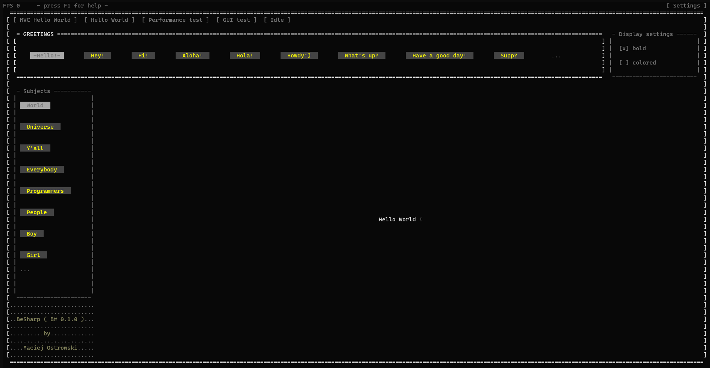

# BeSharp MVC Hello World 

## Demo Showcase App for BeSharp Framework 

---
Intention of this project is a feedback about [BeSharp Framework](https://github.com/mmmostrowski/besharp). 

---




---

### Reasoning
The purpose of this "Hello World" application is to demonstrate the object-oriented code layout of the BeSharp Framework and to test various object-oriented patterns such as composition, decoration, events, and factories.

The Model-View-Controller (MVC) pattern may not be a natural fit for the Bash programming language, but it provides a good visual representation of object-oriented programming. 
Additionally, rendering GUI is a resource-intensive task, making it an ideal field for performance research and optimization.

A typical Bash application would include classes such as `Credentials` or `DockerParamsGenerator` rather than `WidgetsTree`

---

### Quick start

To quickly start the demo showcase app, you can use Docker by running the following command:
```shell
docker pull mmmostrowski/besharp-mvc-hello-world \
  && docker run -it --rm mmmostrowski/besharp-mvc-hello-world
```

:point_right: The source code of this app can be found under `/app/src/` [folder](app/src). :point_left:

:point_right: The executable Bash script of this application is located in `/app/dist/single-script/app` [file](app/dist/single-script/app). :point_left:

---
### Develop locally

**Warning: Please ensure that you have a Docker Engine installed on your machine before proceeding!**

_Note: If you do not have Docker installed on your machine, please refer to the installation instructions on the [BeSharp Framework](https://github.com/mmmostrowski/besharp) project page._


1. Clone project to a local folder. Open it in your favorite IDE.
2. Open BeSharp terminal:
   - **on Linux / MacOs** - please run `./besharp` from the project folder,
   - **on Windows** - please run `besharp.bat` from the project folder.
3. Please run `run` command from the BeSharp terminal. You should have the app working.
4. Please quit the app (e.x. hit `CTRL + C`).
5. In your IDE, please open `AppState.sh` file. Please change line:
```shell
@var isHelloWorldColorsEnabled = false
```
to
```shell
@var isHelloWorldColorsEnabled = true
```
6. In BeSharp terminal, please run `run` again. <br> 
   You should now see a colored _"Hello world !"_ text, by default. <br>
   Please notice how widget data binding mechanism has changed upper right corner checkbox state accordingly.   
7. Please quit app again (e.x. hit `CTRL + C`). Please go back to your IDE, open `HelloWorldWidget.sh` file, and change line:
```shell
@let color = @pixel_modes.randomColor
```
to
```shell
@let color = @pixel_modes.magento
```
8. Please `run` again. You should get an error message, something similar to:
```shell
./app: line 30597: @pixel_modes.magento: command not found
```
It would be hard to debug such an error message. The file `app/dist/single-script/app` is huge!<br>
   
10. Let's now run `develop` command instead of `run` command in the BeSharp terminal.<br>
Now, we can easily read from the given stacktrace, where the error exactly comes from: 
```shell
...
     at: HelloWorldWidget.draw()   /besharp/app/src/View/Widgets/HelloWorldWidget.sh:91 
...
```
11. Ok. Let's fix the bug. Please search for "`@static { @pixel_modes }`" phrase in your IDE.<br>
    `PixelModes.sh` file is where a solution for our bug can be found:
```shell
    @var magenta = "\e[95m"
```
12. Now replace `magento` to `magenta` in the `HelloWorldWidget.sh` file and run `run` again.


<br>
Congratulations, you have successfully completed your first development session in the BeSharp Framework!

---

BeSharp by Maciej Ostrowski (c) 2023
